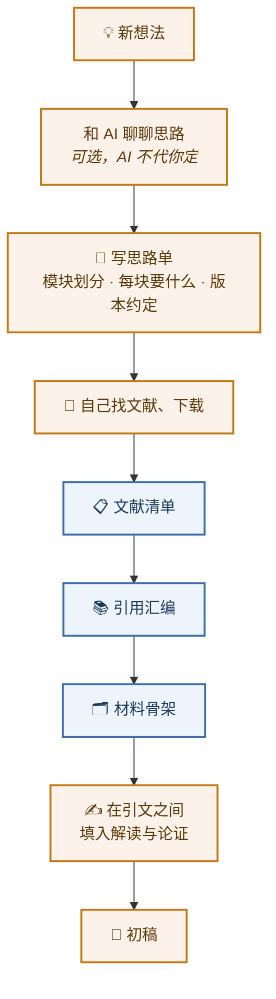

<div align="center">

# 🔪 切配 · Qiepei

**中文社科／人文论文写作的备料 skill**

*AI 切，人炒*

[](https://claude.com/claude-code)
[](LICENSE)
[](#)
[](#)

</div>

---

## 这个 skill 解决什么问题

让 AI 写论文初稿，是个看起来省力、实际更累的方案。

AI 自己"理解"材料的时候错误太多：引文张冠李戴，页码凭空生成，把作者的论证过程当成作者的论点，把你没打算说的话塞进你的段落。产出的稿子作者自己都不能看，看了再改，比重写还慢两倍。

问题不在 AI 不够聪明，而在**分工错了**。

把写论文看成一场烹饪。炒菜——对材料的解读、论证的排布与力度、行文的分寸——是厨师的手艺，换个人炒就不是那道菜了。但备料不是：读文献、找承重句、录原文、核页码、按模块分堆、排上锅顺序，这些活又苦又慢，且有明确的对错标准。

**这个 skill 把 AI 摁在切配的位置上。** 它不炒菜，只备料——而且是一份能直接下锅的备料。

---

## AI 交出什么

| 产出 | 是什么 |
|:--|:--|
| 📋 **文献清单** | 每份文件的类型、版本、对应哪个模块、有什么毛病（缺页、无印刷页码、OCR 质量差） |
| 📚 **引用汇编** | 全章要用的引文，每条带原文、完整出处、模块归属、一句便签。可径直落成脚注 |
| 🗂 **材料骨架** | 汇编按你的顺序排成一篇带脚注的正文，引文之间只有连接句，没有一个字是炒过的 |
| ✅ **三张单子** | 待核（页码没定死的）、未收（考虑过但没收的，写明原因）、缺口（你要而文献里没有的） |

你拿到骨架，在引文之间填入自己的解读与论证，就是初稿。

---

## 工作流



<div align="center"><sub>🟠 厨师（你）　🔵 切配（AI）</sub></div>

---

## 三条铁律

> ### 1️⃣ 不凭记忆下料
> 每条引文都要能在你给的文件里翻到，**文件名＋印刷页码**。记忆里的句子再熟也不进正文。思路单要而文献里没有的，如实报缺口，不填补。

> ### 2️⃣ 不炒
> 不解读、不评价、不推论、不把材料接到你的命题上。汇编里的便签只能"指"，不能"论"。骨架里的连接句只准四类：路线图句、定位句、引导句、交代句。附一张禁用词表，"因此""可见""这说明""意味着"一律不出现。

> ### 3️⃣ 不改字
> 原文照录。删节只在同页同段内，跨页跨段的拆成两条分别标页。转引必标"转引自"。页码定不下来就写"待核"并留下定位记录，不猜。

违反任何一条，你就不敢用这份材料，整份工作作废。**宁可少切、切慢，不可切错。**

---

## 分工表

| 环节 | 厨师（你） | 切配（AI） |
|:--|:--:|:--:|
| 选题、宏观思路、模块划分 | **定** | 可陪聊，不代定 |
| 找文献、下载文献 | **做** | 不做 |
| 读文献、找句、录原文、标出处 | 抽查 | **做** |
| 按模块分组、排序、贴便签 | 调整 | **做** |
| 解读材料、安排论证、下论断、行文 | **做** | 不做 |
| 页码核对、脚注格式、参考文献 | 抽查 | **做** |

---

## 安装

**Claude Code**

```bash
git clone https://github.com/yanouyuan-bit/Qiepei.git ~/.claude/skills/qiepei
```

也可以放进项目里的 `.claude/skills/qiepei/`。

**Claude 桌面端／网页端**　把整个仓库打包成 zip，作为自定义 skill 上传。

---

## 使用

<table>
<tr><td width="40"><b>1</b></td><td>填好 <a href="assets/templates/_模板-思路单.md">思路单模板</a>：章标题、模块划分、每个模块要什么材料、版本约定。</td></tr>
<tr><td><b>2</b></td><td>把参考文献放进一个文件夹。</td></tr>
<tr><td><b>3</b></td><td>对 Claude 说：<code>切配：思路单在 X，文献在 Y，先出文献清单。</code></td></tr>
<tr><td><b>4</b></td><td>确认清单后：<code>出引用汇编。</code></td></tr>
<tr><td><b>5</b></td><td>汇编改定后：<code>出第一节的材料骨架。</code></td></tr>
<tr><td><b>6</b></td><td>交付前自检：<code>python scripts/check_footnotes.py 骨架.md 汇编.md</code></td></tr>
</table>

自检脚本会查：脚注引用与定义是否一一对应、编号是否连续、连接句里有没有禁用词、**每条引文能不能在汇编里找到**。最后一条是防伪造引文的关键闸门。

---

## 目录

```
📄 SKILL.md                        主文件：分工、铁律、四阶段工作流、便签与连接句规则
📁 references/
   📄 reading-guide.md             读料：PDF／扫描／OCR、印刷页码取法、繁简、转引
   📄 huibian-spec.md              引用汇编的结构与规则
   📄 gujia-spec.md                材料骨架的结构、连接句四类、禁用词表
   📄 citation-style.md            脚注与参考文献著录格式
📁 assets/
   📁 templates/                   思路单、引用汇编、材料骨架三个模板
   📁 examples/                    汇编与骨架的节选示例（虚构材料，只看格式）
📁 scripts/
   📄 check_footnotes.py           自检脚本
```

---

## 适合谁

- 写学位论文、期刊论文的社科与人文研究者
- 材料密集型写作：思想史、哲学、文学、历史、法学、社会学
- 尤其是**引文多、版本讲究、脚注严格**的中文写作
- 已经吃过"让 AI 写初稿反而更慢"这个亏的人

## 不适合谁

- 想让 AI 直接产出成稿的
- 材料靠 AI 检索而非自己下载的
- 不在意引文出处与页码的

---

<div align="center">

**厨师的锅里放什么、先放什么、放多少，切配一概不管。**

**切配只保证：案板上每一块料都来路清楚、切口干净、贴好标签。**

<br>

[](LICENSE)

</div>
